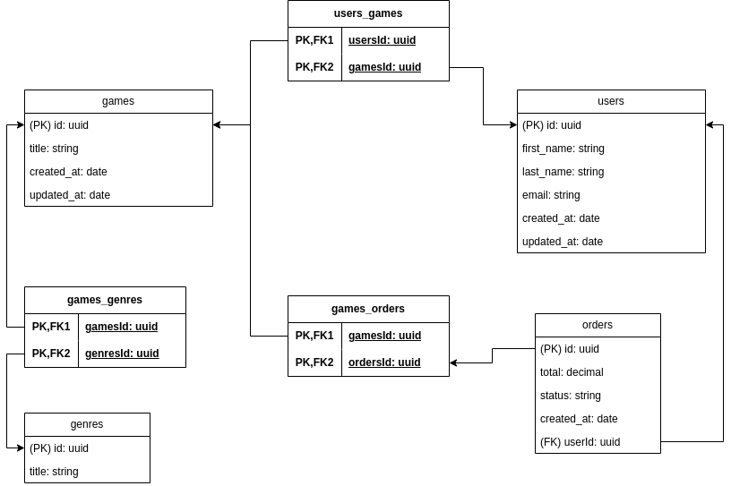

# Desafio 02 - Modelagem do banco de dados

# 💻 Sobre o desafio

Nesse desafio você irá incrementar a aplicação feita no desafio anterior.

<aside>
⚠️ Atenção: Essa será apenas a modelagem do banco de dados, portanto não requer nenhum código.
</aside>

A aplicação deve ter uma tabela de gêneros (`genres`) para que cada jogo possa ter um ou mais gênero e, além disso, uma tabela `orders` deve existir para que um usuário consiga comprar um ou mais jogos na mesma compra.

Um extra seria colocar as cardinalidades entre as entidades mas não tome isso como obrigatório.

# 📅 Entrega

